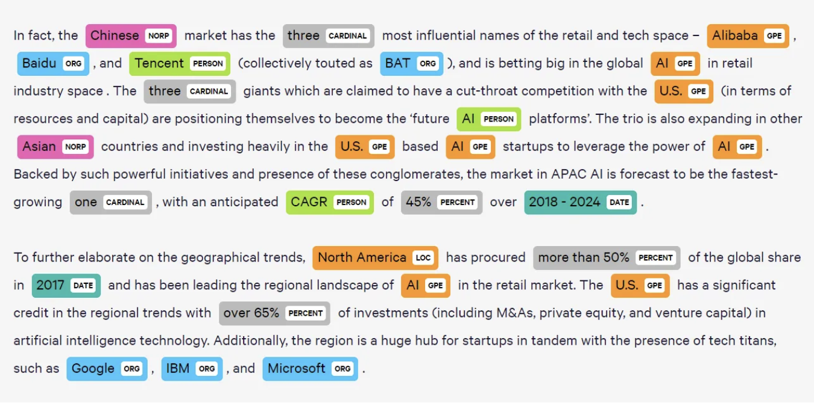
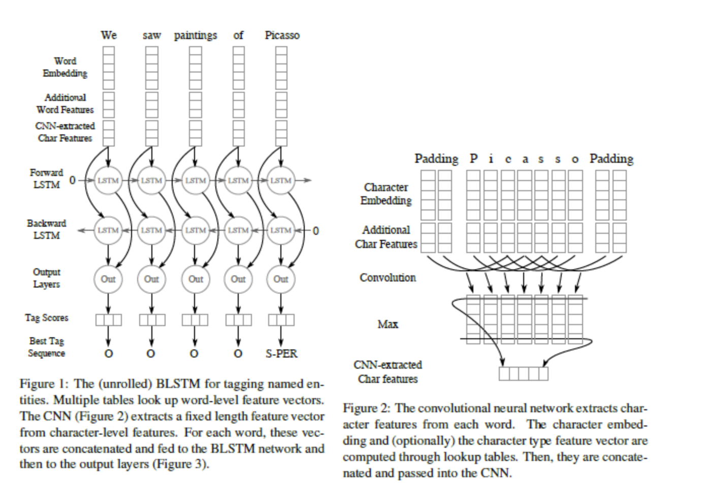

# Named-Entity-Recognition-with-Bidirectional-LSTM-CNNs
A keras implementation of Bidirectional-LSTM_CNNs for Named-Entity-Recoganition. The original paper can be found at https://arxiv.org/abs/1511.08308
*	Created hybrid Bidirectional LSTM-CNNs model that extracts word- and character-level features with word embedding GloVe to solve sequential labelling task, named entity recognition (NER), and achieved F1 score of 90.9 on CoNLL 2003 benchmark
*	Employed convolution and pooling layers to further exploit character- and casing-level patterns in addition to tokenization, Bi-LSTM and trained word embeddings, and outperformed baseline LSTM model with random word embeddings by 19%
*	Trained model by mini-batch stochastic gradient descent (SGD) with fixed learning rate to maximize sentence-level log-likelihood, dropout to output nodes of LSTM layer to reduce overfitting, and hyperparameter optimization by random search

## Result
The Bi-directional LSTM-CNNs model achieved F1 score of 90.9 on CoNLL 2003 benchmark

## Data and Resources Used
**Data:** CoNLL 2003

**Packages:** TensorFlow, Keras, Numpy

## Approaches
Hybrid Bi-directional LSTM-CNNs

